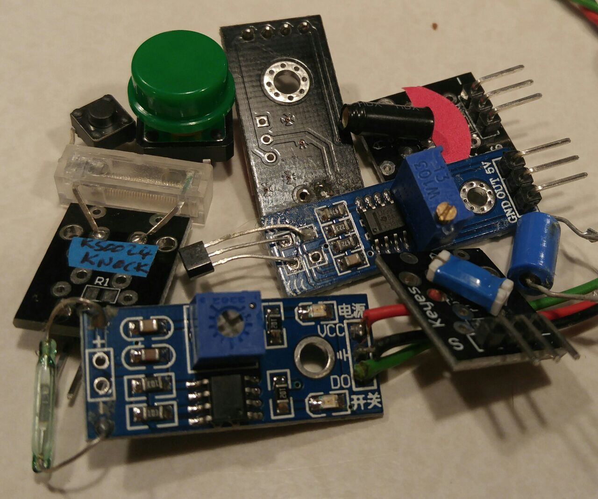
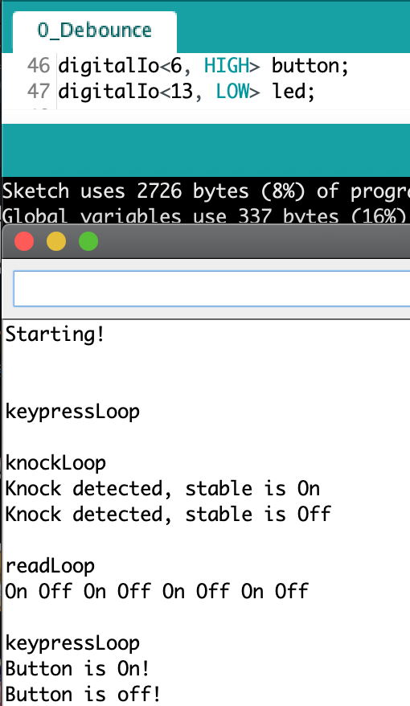
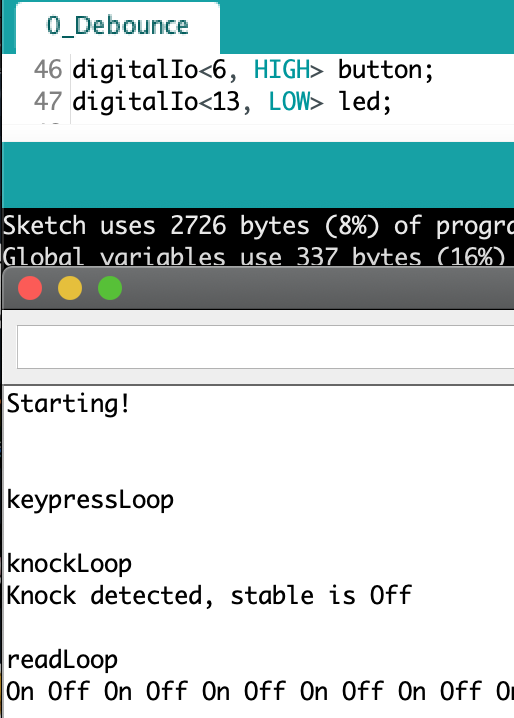

# DigitalIo
A library for digital I/O that simplifies programming switches, buttons, knock sensors, etc. on Arduinos

## Overview



This library can be used for any digital pin input signal, from sensors such as:
* ON/OFF contacts
* Transient contacts
* Push buttons
* KS0024 Bump or Knock Sensor
* KS0025 Tilt Digital Motion Sensor
* Tilt Switch
* KY-017 Mercury Switch
* A3144 Hall sensor switch
* KS0038 Reed Switch
etc.

You an use digitalRead() or digitalWrite() directly to perform I/O on digital pins.
This performs raw accesses to the port (and is realtively slow because of the way the Arduino translation layer is implemented).

Alternatively you can use this DigitalIO library:

* The syntax is more concise
* For inputs it provides compact debounce code that will filter out glitches when reading values
* It implements transition or levels debouncing, to support a variety of sensors and switches, including knock sensors
* Configuration macros can be used to override the default debounce duration to make the code more resilient to line noise or faster response for clean signals
* Debounce function returns immediately in the common case when there is no signal transition
* The library is coded to have near-zero code overhead
* An AVR specific version can be used by changing the declaration of your variable.
* Each instance of the class takes only 1 byte of dynamic memory.

The debounce logic is embedded in the class, so it does not clutter your code. It is also extremely fast and efficient when no debounce is needed,
making it a good choice for programs that concurrently manage multiple things at the same time.

## Installation

Create a DigitalIo directory and copy the content of this repository into it (on Windows: MyDocuments/Arduino/libraries/DigitalIo)

See the examples for more information (File -> Examples -> DigitalIO).

## Memory usage

The library comes with the classes digitalIo and digitaIoAvr. The AVR specific version doesn't use the Arduino digitalRead() or
digitalWrite() commands so it is 500B smaller, and is faster, as shown in these screenshots.


* Debounce routines require only 40 to 64B of "program storage space" memory, and return immediately unless an event to debounce is detected.
* Simple read, write and config methods are inlined and have zero overhead
* Each instance of the class uses only 1 byte of "dynamic memory" to store the last value read or written.

## 0_Debounce code example
You can load the example from the Files->Example->DigitalIO menu, compile and load it to an Arduino Uno as-is and test it with a button or any other digital sensor.
Use the Tools->Serial Monitor menu to bring up the console. It will cycle between 3 modes and show you how your sensor behaves with each mode.

Push buttons:

When using a push button or any other on/off sensor, they will change the signal level when they are enabled or detect an event. The transition from one state to another might be noisy and debounce will prevent detecting fake successive transitions. Again you can see in the raw "read" mode any noise your sensor can generate when changing state. The keypress mode will detect the keypress and key release because it will see the change in voltage level on the line. The debounce code will ignore any temporary transition and record a button event only when the level change is stable for a minimum time duration. The debounce code will ignore immediately any transition if the level goes back to the original level, instead of trying to wait for it to stabilize. If it is a valid level transition it will eventually become stable and be detected as such the next time the signal is sampled.



Knock sensors:

When using a knock sensor or similar event detection sensor, they typically will send a brief signal on the input pin that needs to be detected. It is also likely it will oscillate a lot and generate a lot of false positives if you do not debounce. The false positives can be seen in the picture in the raw "read" mode. The keypress mode does not detect any key pressed because it sees a knock as noise on the line. The Knock mode detects the brief signal and filters the associated oscillations via a debounce. The debounce only kicks in when a signal is first detected, if not the routine returns immediately. The debounce code will also make sure the line becomes stable for a minimum duration.

Note: Your loop needs to be fast enough to run through the knock detection fuction before the transitory signal disappears, else you might not detect it. This will be dependent on how you code your main loop.



## Example A: Button

The following example shows how to use the library with a push button for which the state is either pressed or released.
In between states (transitions) are not detected but stable level changes are.

The debounce logic will detect an event only if there is a stable line level change (for example HIGH to LOW), and will
filter out any glitch or brief transitions to a different state, and discount it as noise.

```cpp
#include <DigitalIo.h>

// LED is at rest when low, and shines when high
digitalIo<13, LOW> led;
// Switch is at rest when high, and grounds the input pin to low when it is pressed
digitalIo<6, HIGH>  pushButton;

void setup() {
  // Set led as output (default is input)
  led.outputMode();
}

void loop() {
  switch (pushButton.debounce())
  {
    case 1:
      // Turn on LED when button is pressed
      led.set();
      break;
    case -1:
      // Turn off LED when button is released
      led.unSet();
      break;
    case 0:
      // Do nothing if button doesn't change
  }
  delay(50);
}
```

## Example B: Knock sensor

The following example shows how to use the library with a knock sensor. When it is activated it only sends a brief pulse.
This detects a dirac pulse (brief transition) and reports it. It does not report stable level changes.

The debounce logic will detect any brief transition on the line, regardless of if it changes the stable line level.
It will however filter out oscillations in the transition and wait for the signal to be stable on the pin.

```cpp
#include <DigitalIo.h>

// Switch is at rest when high, and grounds the pin to lowwhen pressed
digitalIo<13, HIGH> led;
digitalIo<6, HIGH>  pushButton;

void setup() {
  led.outputMode();
}

void loop() {
  if (pushButton.isActivated())
  {
    // Toggle the LED when a knock is detected
    led.write(! led.read());
  }
  delay(50);
}
```


## Contributing

1. Fork it!
2. Create your feature branch: `git checkout -b my-new-feature`
3. Commit your changes: `git commit -am 'Add some feature'`
4. Push to the branch: `git push origin my-new-feature`
5. Submit a pull request

## History

1. Version 1.0 (DigitalSwitch - alpha version)
2. Version 2.0 (DigitalIO - Debounce transient signals, handle output,AVR version)

## Credits

Copyright (c) 2015-2019, Dan Truong

## MIT License

See the LICENCE file.
